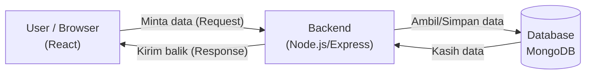

# 🎤 Contekan Presentasi: Website Waveneap

> [!TIP]
> Baca santai, poin-poin di bawah ini urut dari pembuka sampai penutup. Tinggal ikutin alurnya bro.

---

## 1. Pembukaan (30 detik)

> "Selamat pagi/siang. Kami dari kelompok [nama], izin mempresentasikan project kami yaitu sebuah **Aplikasi Web Manajemen Toko / Bisnis** berbasis **Full Stack**. Website ini sudah kami *deploy online* dan bisa diakses langsung di **pw.halomok.com**."

**Poin jualan utama (sebutin ini biar keliatan niat):**
- Bukan cuma tampilan (frontend), tapi datanya **beneran tersimpan di database** (dinamis).
- Sudah **online / live di internet**, bukan cuma jalan di localhost.
- Ada sistem **login & hak akses** (keamanan).

---

## 2. Teknologi yang Dipakai (Tech Stack)

Ini kami pakai arsitektur **MERN Stack**:

| Bagian | Teknologi | Fungsi Sederhana |
|---|---|---|
| **Frontend** | React (Vite) | Tampilan yang dilihat & diklik user |
| **Backend** | Node.js + Express | "Otak" / logika yang ngatur data |
| **Database** | MongoDB Atlas | Tempat nyimpen semua data (produk, user, transaksi) |
| **Server** | VPS + aaPanel + Nginx | Rumah tempat website di-*hosting* online |

> Kalau ditanya "kenapa React?": *"Karena React itu component-based, jadi kode bisa dipakai ulang dan tampilannya update otomatis tanpa reload halaman."*

---

## 3. Fitur Utama Aplikasi

Jelasin fitur sambil demo di layar (urut aja):

1. **Halaman Utama (Home)** — Landing page pengenalan.
2. **Login & Autentikasi** — User harus login dulu. Pakai **JWT (Token)** biar aman & password di-*hash* (dienkripsi) pakai bcrypt.
3. **Dashboard** — Menampilkan ringkasan data / statistik bisnis.
4. **Katalog Produk** — Bisa **Tambah, Lihat, Edit, Hapus** produk (istilahnya **CRUD**), lengkap dengan **upload gambar**.
5. **Manajemen User** — Admin bisa ngatur data pengguna.
6. **Manajemen Transaksi** — Pencatatan transaksi.

> [!IMPORTANT]
> Kata kunci sakti yang bikin dosen suka: **CRUD** (Create, Read, Update, Delete) dan **Autentikasi**. Sebutin kata ini!

---

## 4. Cara Kerja Sistem (Alur Data)

Ini penjelasan gampangnya kalau ditanya "gimana cara kerjanya?":

**Analogi restoran (biar juri paham):**
- **Frontend (React)** = Pelayan & menu yang dilihat pelanggan.
- **Backend (Node.js)** = Dapur yang masak & atur pesanan.
- **Database (MongoDB)** = Gudang bahan makanan.

> "Jadi saat user klik tombol, React ngirim permintaan ke Node.js, lalu Node.js ngambil data dari MongoDB, terus dikirim balik ke tampilan."

---

## 5. Bagian Deployment (Nilai Plus!)

> "Yang bikin project kami beda, kami nggak cuma jalanin di laptop, tapi kami **deploy ke server VPS sungguhan** pakai **aaPanel** dan **Nginx** sebagai *reverse proxy*, jadi bisa diakses siapa saja lewat internet dengan domain sendiri dan sudah **HTTPS (aman/gembok hijau)**."

---

## 6. Pembagian Tugas Kelompok
*(Isi sesuai realita kelompok kamu, contoh:)*
- **[Nama 1]**: Frontend (React & Desain UI)
- **[Nama 2]**: Backend (Node.js & API)
- **[Nama 3]**: Database & Deployment

---

## 7. Penutup

> "Demikian presentasi dari kami. Kesimpulannya, kami berhasil membangun aplikasi web full-stack yang dinamis, aman dengan sistem login, dan sudah live online. Terima kasih, kami buka sesi tanya jawab."

---

## 🛡️ ANTISIPASI PERTANYAAN DOSEN (PENTING!)

Baca ini biar nggak gugup pas ditanya:

**T: Apa itu API?**
> J: API itu jembatan/perantara yang menghubungkan Frontend dan Backend supaya bisa saling tukar data.

**T: Kenapa pakai MongoDB, bukan MySQL?**
> J: Karena MongoDB itu NoSQL, datanya fleksibel berbentuk dokumen (JSON), cocok banget dan gampang nyambung sama JavaScript (Node.js).

**T: Gimana keamanan login-nya?**
> J: Password user tidak disimpan mentah, tapi di-*hash* (diacak) pakai **bcrypt**. Dan saat login, sistem ngasih **Token JWT** sebagai tanda pengenal biar sesi login aman.

**T: Apa itu CRUD?**
> J: Create (tambah), Read (baca/lihat), Update (edit), Delete (hapus). Ini operasi dasar mengelola data, dan semua fitur produk kami sudah menerapkannya.

**T: Apa kesulitan/tantangan kalian?**
> J: Tantangan terbesar saat **deployment ke server**, karena ada bentrok *port* dan pengaturan *Nginx* untuk mengarahkan traffic ke backend. Tapi berhasil kami atasi. *(Ini jawaban jujur & keren, dosen suka cerita struggle)*

**T: Apa itu Reverse Proxy (Nginx)?**
> J: Nginx bertugas menerima semua pengunjung, lalu mengarahkan permintaan halaman ke React, dan permintaan data (`/api`) ke server Node.js.
